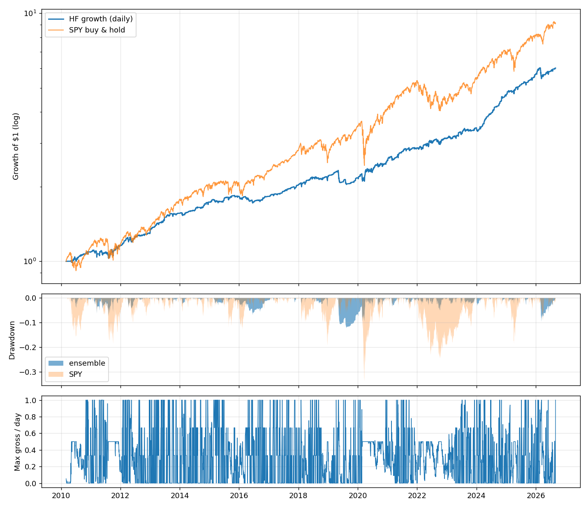

# quantbot

A quantitative research and paper-trading system for US equities. Two systems
live here:

- **HF** (`run.py hf ...`) - the short-horizon system: trades at the open and
  close auctions every day, holds for hours, currently paper-trading **$1,000
  of fake money** on a fixed schedule. This is the main system.
- **Daily ensemble** (`run.py backtest` / `run.py paper`) - the original
  weekly-rebalanced momentum/trend/mean-reversion long-only book. Kept as is.

> **Honest expectations.** True high-frequency trading (microseconds, order-book
> data, colocation) is not possible with retail data; the fastest edge that
> survives realistic costs on public data is the *session* edge - who holds
> the overnight gap and who provides liquidity at the open. That is what the
> HF system trades. A backtest is an upper bound, not a promise: expect live
> results to be worse than the numbers below and treat the paper account as
> the test of *how much* worse.

## HF system: what it trades

Two sleeves that never hold capital at the same time (zero return correlation),
plus a risk layer. Everything is causal; the live trader reads the same weight
matrix the backtest produces, at the current session timestamp.

**1. Overnight premium** (`strategies/hf_overnight.py`) - 16:00 -> 09:30.
Hold 1/3 each of QQQ (via the 2x fund QLD in the default profile), SMH and IWM
overnight when (a) the ETF closes above its own 200-day MA and (b) the sum of
its last 5 overnight returns is negative. In the market ~22% of nights.
Literature: Lou, Polk & Skouras (2019), Bogousslavsky (2021).

**2. Gap-fade reversal** (`strategies/hf_reversal.py`) - 09:30 -> 16:00.
At the open, buy the 7 mega-caps (out of 70) with the most negative
beta-adjusted, volatility-scaled overnight gap; flat at the close. Exposure
scales with yesterday's VIX: zero at VIX <= 18, full at 28 (reversal is paid
liquidity provision and only clears costs when volatility is high - Nagel 2012).

**Risk layer** (`strategies/hf_regime.py`) - the overnight sleeve is scaled by
`clip((SPY > 200d MA ? 1 : 0.5) x (0.16 / QQQ 20d realised vol)^2, 0.1, 1)`
(Moreira & Muir 2017 volatility management plus a trend gate), and the whole
book is halved after a 10% drawdown. Cash account: gross long never exceeds
1.0 of equity; leverage above 1x exists only through 2x/3x ETFs.

**Costs**: 1 bp/side on ETFs, 2 bp on leveraged ETFs, 2.5 bp on stocks
(2-5x what a $1k account pays at a zero-commission broker with auction
orders). Idle cash earns the **historical 13-week T-bill rate** (`^IRX`,
~0% in 2010-21, ~5% in 2023-24, mean 1.5%); every Sharpe below is in excess
of it, so sitting in cash earns no ratio boost.

## Backtest results (Mar 2010 - Sep 2026, daily 09:30/16:00 timeline, net)

| profile | CAGR | Vol | Sharpe | MaxDD | OOS 2022+ Sharpe | OOS CAGR |
|---|---|---|---|---|---|---|
| balanced (1x, reversal 0.5) | 10.0% | 6.4% | 1.28 | -9.0% | 1.49 | 15.2% |
| **growth (QLD 2x, reversal 0.5) - default** | **11.5%** | **7.4%** | **1.31** | **-12.2%** | **1.53** | **17.3%** |
| max (TQQQ 3x, reversal 1.0) | 16.9% | 11.5% | 1.28 | -14.8% | 1.43 | 23.4% |
| margin2x (balanced book at 2x on margin, T-bill+1.5%) | 17.6% | 12.5% | 1.24 | -14.9% | 1.48 | 26.4% |
| SPY buy & hold | 14.3% | 17.1% | 0.78 | -33.7% | - | - |

`margin2x` is not implementable in a cash account; it exists to make the SPY
comparison volatility-matched. Return is Sharpe x volatility: the cash
profiles trail SPY in raw return only because they average ~17% invested.

### Round 2: breadth and diversification (`research/notes/*_wide.md`, `crossasset.md`, `etf_reversal.md`)

Goal: more *independent* bets per day, not faster trading (see the Medallion
discussion in the notes: return = Sharpe x leverage; frequency is only useful
if the per-trade edge exceeds the per-trade cost, which retail data cannot
deliver below the daily horizon).

| candidate | result | decision |
|---|---|---|
| Reversal sleeve on 300 names instead of 70 (`growth-wide`) | ensemble Sharpe 1.31 -> **1.64**, CAGR 11.5% -> 15.5%, MaxDD -12.4%; but OOS 1.47 vs 1.53 and the whole gain sits in the least-liquid tail (5 bp/side assumed there) | **shadow account** `shadow-wide`, $1,000, same sessions as live; switch live only if tail fills prove <~3 bp over ~60 active days |
| TLT/GLD open-to-close gap continuation (`hf_crossasset.py`) | real gross edge (t 4.7) but net Sharpe 0.44, deflated-Sharpe P 0.13, needs shorts; +0.06 ensemble Sharpe at 0.25 | wired, allocation 0 (fails the same gate that rejected intraday momentum) |
| Cross-sectional reversal among sector/region ETFs (`hf_etf_reversal.py`) | ~0 gross Sharpe at every horizon; hurts the ensemble at any allocation | negative result, not wired |

Growth profile details: 15 of 17 calendar years positive (2016 -0.1%,
2019 -1.4%); average exposure 17% of equity; cost drag 2.8%/yr; bootstrap 95%
CI for Sharpe [0.85, 1.77]; deflated-Sharpe probability 0.98 after counting
all ~1,200 strategy variants the research agents evaluated. The three profiles
sit on the same Sharpe plateau - leverage only moves return and drawdown.
SPY's raw CAGR is higher over what was a historic bull market; the system
earns its return with 43% of SPY's volatility and a third of its drawdown.



Full research trail, including negative results (classic close-to-close
reversal, first-half-hour intraday momentum, VIX-term-structure timing,
leveraged-ETF economics), is in `research/notes/`.

### Adversarial audit (`research/notes/REDTEAM.md`)

An independent red-team pass on the final system: **no lookahead** (190/190
truncation tests identical, live masking path identical at 26 stamps), engine
accounting exact to 1e-12, dividends consistent. Caveats it raised, and what
was done:

- *Flat 4% cash carry inflated CAGR by ~3.6pp and made every year positive.*
  Fixed: the engine now uses the historical T-bill rate (table above).
- *A 09:30 data outage would silently hold the 2x overnight book all day.*
  Fixed: the trader now fails loudly and a retry run is scheduled 14 min later.
- *Reversal allocation (0.75) exceeded what its own research supports.*
  Reduced to 0.5 (same Sharpe plateau).
- *Costs*: Sharpe stays above 0.5 until costs are 2.8x the assumed level; the
  paper account charges the assumed costs, so it cannot detect a real-world
  cost miss - only a broker paper API can.
- *Reversal fill assumption*: signal and fill both use the 09:30 print; a
  10:30 fill destroys the edge. Live this requires pre-open gap computation
  and market-on-open orders.
- *Universe*: restricting the reversal sleeve to the 38 largest names drops
  the ensemble Sharpe to ~1.0; cross-sectional alpha has thinned since 2023.
- *Signal shift +1 day* -> Sharpe 0.68 (decays, does not collapse: consistent
  with a real, fast-decaying edge rather than an artefact).

## Running it

```bash
python3 -m pip install --user -r requirements.txt

python3 run.py hf backtest --profile growth --sleeves --plot   # reproduce the table
python3 run.py hf backtest --timeline hourly                   # ~2y, includes hourly data

python3 run.py hf reset --capital 1000 --profile growth   # fresh live paper account
python3 run.py hf trade --session auto                    # process the latest session (all accounts)
python3 run.py hf status                                  # P&L, positions, expectation card, chart
python3 run.py hf status --account shadow-wide            # same for a shadow account
python3 run.py hf reset --account <name> --profile <p>    # create/reset a shadow account
python3 run.py hf schedule --install                      # launchd: 09:33 and 16:08 ET (+retries), Mon-Fri
```

### Paper accounts (live now)

- **live**: started **2026-09-01 16:00 ET with $1,000**, profile `growth`
  (`paper_state/hf/`).
- **shadow-wide**: started 2026-09-02 16:00 ET with $1,000, profile
  `growth-wide` (`paper_state/hf/accounts/shadow-wide/`). Same sessions, same
  schedule; exists to measure whether the 300-name reversal book's edge
  survives real fills before the live account adopts it.
- Two sessions per trading day, run automatically by `launchd`
  (`~/Library/LaunchAgents/com.quantbot.hf.plist`): 09:33 ET fills at the
  official open print, 16:08 ET fills at the official close print - the
  same prices a market-on-open / market-on-close order would receive. Each
  has a retry run 14-17 minutes later (idempotent) in case Yahoo is late; if
  a session's data is still missing the run exits with an error in
  `paper_state/hf/log.txt` rather than silently holding positions.
- State in `paper_state/hf/`: `state.json` (cash, positions), `trades.csv`
  (every fill), `history.csv` (equity per session), `log.txt`, `equity.png`.
- `hf trade` is idempotent (a session is processed once). If the machine was
  asleep, launchd runs the job on wake; the fill still uses the session print
  and the log notes how late it ran.
- **The Mac must be awake at 06:33 and 13:08 Pacific** (09:33 / 16:08 ET;
  retries at 06:47 / 13:25).
  A closed lid sleeps it and nothing runs. Either keep it on power with
  "prevent automatic sleeping" enabled, schedule wakes with
  `sudo pmset repeat wakeorpoweron MTWRF 06:30:00`, or move the two cron
  lines printed by `hf schedule` to an always-on machine.

### How to judge it (`hf status`)

`status` prints an **expectation card**: the backtest's daily mean, standard
deviation, hit rate and typical exposure for the account's profile, and
whether the live cumulative return is inside the 2-sigma band the backtest
predicts for the number of days elapsed. Inside the band means "behaving as
designed" regardless of sign; sustained results below the band mean
investigate data and fills before touching parameters.

Checkpoints:
1. **Week 1** - plumbing: fills happen at both sessions, exposure matches the
   card (~20% average, 100% on nights all three overnight signals fire),
   costs ~1-3 bp per fill, no missed sessions.
2. **60 trading days** - first performance read: hit rate and daily sd should
   match the card; the Sharpe will still be noise.
3. **6 months** - go/no-go versus the backtest band. A Sharpe of ~1.2 needs
   about 2.8 years of live data to be statistically distinguishable from zero;
   before then judge *shape* (exposure, hit rate, drawdown depth), not sign.

Parameters are deliberately **not** re-tuned on live results; that is how
edges get overfit away. Changes go through a backtest, the validation tools
in `quantbot/validation.py`, and a note in `research/notes/`.

## Known limitations

- Survivorship bias in the 70-stock universe (today's mega-caps applied back
  to 2010) flatters the reversal sleeve; the ETF overnight sleeve is immune.
- The reversal sleeve's signal uses the 09:30 auction print and assumes a fill
  at that same print. Live, that means computing the gap from the ~09:28
  pre-market quote and sending market-on-open orders; the paper trader fills
  at the open print directly.
- Under the pattern-day-trader rule a real account under $25k cannot run the
  reversal sleeve (open -> close is a day trade) more than 3 times a week.
  The overnight sleeve (close -> open) is not a day trade.
- Yahoo Finance is the only data source. Intraday history accumulates in
  `data_cache/ohlcv_1h.parquet` each run (Yahoo serves only ~2 years).

## Project layout

```
run.py                        CLI (hf ... and the legacy backtest/paper commands)
quantbot/
  config.py                   universes, cost model, HFConfig / Config
  data.py                     Yahoo OHLCV + hourly bars, caching, session price panels, MarketData
  engine.py                   session-based long/short backtest engine (costs, carry, drift-adjusted turnover)
  metrics.py, validation.py   Sharpe/Sortino/DD; OOS split, bootstrap CI, deflated Sharpe, sensitivity
  research.py                 standard scorecard used by every research note
  hf_paper.py                 $1k paper trader (sessions, masking, expectation card, chart)
  schedule.py                 launchd installer for the daily sessions
  strategies/
    hf_overnight.py           overnight premium sleeve
    hf_reversal.py            gap-fade reversal sleeve
    hf_regime.py              regime multiplier, vol regime, leverage map, drawdown throttle
    hf_intraday_momentum.py   researched, allocation 0 (negative result)
    hf_crossasset.py          TLT/GLD gap continuation, wired at allocation 0 (thin edge)
    hf_etf_reversal.py        researched, not wired (negative result)
    hf_ensemble.py            profiles, sleeve combination, risk layer, backtest runner
  universe_wide.py            300-name stock universe for the wide profile / shadow account
    momentum.py trend.py mean_reversion.py ensemble.py   legacy daily system
  backtest.py, paper.py       legacy daily system engine and paper trader
research/notes/               BRIEF.md (research contract), one note per sleeve, REDTEAM.md
paper_state/hf/               live paper account
```

## Road to real money (in order, no shortcuts)

1. Paper-trade for 6 months minimum; compare to the expectation card.
2. Then connect a broker paper API (e.g. Alpaca) and repeat - real auction
   fills, real data latency.
3. Size real capital so a 20% loss changes nothing about your life.
