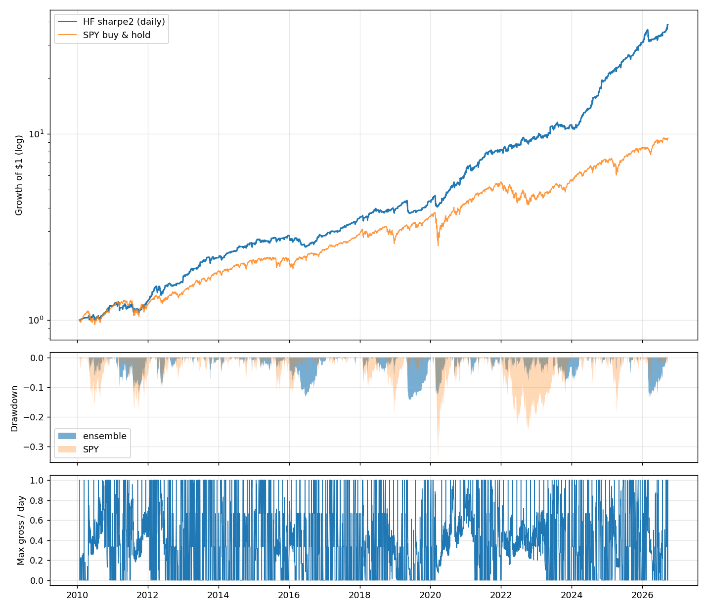

# quantbot

A quantitative research and paper-trading system for US equities. Two systems
live here:

- **HF** (`run.py hf ...`) - the short-horizon system: trades at the open and
  close auctions every day, holds for hours, currently paper-trading **$1,000
  of fake money** on a fixed schedule. This is the main system.
- **Daily ensemble** (`run.py backtest` / `run.py paper`) - the original
  weekly-rebalanced momentum/trend/mean-reversion long-only book. Kept as is.

> **Honest expectations.** True high-frequency trading (microseconds, order-book
> data, colocation) is not possible with retail data; the fastest edge that
> survives realistic costs on public data is the *session* edge - who holds
> the overnight gap and who provides liquidity at the open. That is what the
> HF system trades. A backtest is an upper bound, not a promise: expect live
> results to be worse than the numbers below and treat the paper account as
> the test of *how much* worse.

## HF system: what it trades

Four sleeves plus a risk layer (profile `sharpe2`, live since 2026-09-24:
the `sharpe` signals run at ~12.8% volatility through 2x/3x funds, plus the
pre-FOMC sleeve). The first two sleeves never hold capital at the same time
(zero return correlation); the third is a small stress-regime satellite; the
fourth trades eight nights a year. Everything is causal; the live trader
reads the same weight matrix the backtest produces, at the current session
timestamp.

**1. Overnight premium** (`strategies/hf_overnight.py`) - 16:00 -> 09:30.
Hold 1/3 each of QQQ (via the 2x fund QLD in the default profile), SMH and IWM
overnight when (a) the ETF closes above its own 200-day MA and (b) the sum of
its last 5 overnight returns is negative. In the market ~22% of nights.
Literature: Lou, Polk & Skouras (2019), Bogousslavsky (2021).

**2. Gap-fade reversal** (`strategies/hf_reversal.py`) - 09:30 -> 16:00.
At the open, buy the 7 mega-caps (out of 70) with the most negative
beta-adjusted, volatility-scaled overnight gap, inverse-vol weighted; flat at
the close. Gated on yesterday's VIX > 18 (reversal is paid liquidity provision
and only clears costs when volatility is high - Nagel 2012) and sized to a 6%
vol target on the equal-weight universe's intraday return: the fade's return
per unit of *variance* is flat in VIX above the gate, so the old dollar ramp
(full size at VIX 28) over-bet the wildest mornings (kurtosis 30, worst day
-4.9%; now 14 and -2.6%). `research/notes/risk_allocation.md`.

**3. Index reversal in stress** (`strategies/hf_ts_reversal.py`) - 16:00 ->
16:00 next day. If QQQ closed down today and VIX > 20, buy QQQ at the close
and hold one full day, sized 0.20 / realised vol; ~40 active days a year.
Index-level liquidity provision (Nagel 2012; Hendershott & Menkveld 2014):
after a down day in high vol the next day averages +25 bp, split evenly
between the night and the day; after an up day, nothing (so no short leg).
Allocation 0.25. `research/notes/ts_reversal.md`.

**4. Pre-FOMC overnight** (`strategies/hf_macro.py`) - 16:00 the day before
each scheduled FOMC decision -> 09:30 on decision day, ~8 nights a year, held
through QLD. The pre-announcement drift (Lucca & Moench 2015): QQQ averages
+21 bp into decision days in-sample and +34 bp out-of-sample (t 3.1 / 3.2)
against ~5 bp on ordinary nights, and the neighbouring nights show nothing.
The other scheduled releases (employment, CPI, PPI) carry no reliable
premium and are not traded. Decision days come from the Fed's published
calendar (`quantbot/macro_calendar.py`). `research/notes/macro.md`.

**Risk layer** (`strategies/hf_regime.py`) - the overnight sleeve is scaled by
`clip((SPY > 200d MA ? 1 : 0.5) x (0.16 / QQQ 20d realised vol)^2, 0.1, 1)`
(Moreira & Muir 2017 volatility management plus a trend gate), and the whole
book is halved after a 10% drawdown. Cash account: gross long never exceeds
1.0 of equity; leverage above 1x exists only through 2x/3x ETFs.

**Costs**: 1 bp/side on ETFs, 2 bp on leveraged ETFs, 2.5 bp on stocks
(2-5x what a $1k account pays at a zero-commission broker with auction
orders). Idle cash earns the **historical 13-week T-bill rate** (`^IRX`,
~0% in 2010-21, ~5% in 2023-24, mean 1.5%); every Sharpe below is in excess
of it, so sitting in cash earns no ratio boost.

## Backtest results (Feb 2010 - Sep 2026, daily 09:30/16:00 timeline, net)

| profile | CAGR | Vol | Sharpe | MaxDD | OOS 2022+ Sharpe | OOS CAGR | losing years |
|---|---|---|---|---|---|---|---|
| balanced (1x, ramp-sized reversal 0.5) | 10.1% | 6.4% | 1.30 | -9.0% | 1.54 | 15.7% | 0 / 17 |
| growth (QLD 2x, ramp-sized reversal 0.5) - live until 2026-09-16 | 11.6% | 7.4% | 1.32 | -12.2% | 1.56 | 17.7% | 2 / 17 |
| max (TQQQ 3x, reversal 1.0) | 17.0% | 11.5% | 1.29 | -14.8% | 1.46 | 23.8% | 1 / 17 |
| sharpe (growth + vol-targeted reversal 1.0 + index-reversal 0.25; 2x QQQ slot only) | 14.0% | 8.2% | 1.46 | -10.6% | 1.71 | 20.8% | 0 / 17 |
| sharpe-max (same, TQQQ in the QQQ slot) | 16.0% | 9.2% | 1.50 | -13.3% | 1.71 | 22.9% | 0 / 17 |
| sharpe-lev (same signals; 3x QQQ slot, 2x SMH/IWM slots, stress sleeve via QLD) - live 09-16 to 09-24 | 21.6% | 12.5% | 1.50 | -14.5% | 1.80 | 32.4% | 0 / 17 |
| **sharpe2 (sharpe-lev + pre-FOMC sleeve via QLD) - live, default** | **24.6%** | **12.8%** | **1.67** | **-14.5%** | **2.01** | **38.9%** | **1 / 17** |
| sharpe-3x (everything 3x: TQQQ / SOXL / TNA) | 26.6% | 15.8% | 1.48 | -19.5% | 1.53 | 29.6% | 1 / 17 |
| sharpe-alt (sharpe + metals overnight 0.25) - shadow only | 15.3% | 8.3% | 1.58 | -9.6% | 1.74 | 21.9% | 0 / 17 |
| SPY buy & hold | 14.5% | 17.1% | 0.80 | -33.7% | - | - | 2 / 17 |

Sharpe is in excess of the historical T-bill rate. `sharpe2`: bootstrap 95%
CI [1.19, 2.12], deflated-Sharpe probability 0.999 after every variant
evaluated in four research rounds (~3,100 trials); worst day -6.6%, worst
year -0.2% (2016); max overnight exposure 2.33x of equity on a night all
three overnight signals fire (~2.2x on an FOMC eve when they also fire).
Switch with `python3 run.py hf switch --profile <name>` (history is kept).

### Sharpe versus return: two dials, not one

**Return = cash yield + Sharpe x volatility.** Sharpe measures the quality of
the edge; the return level is a *sizing* choice. The four `sharpe*` rows
above are the same signals at different volatility and land on the same
Sharpe (1.46-1.50) - leverage moves return and drawdown together and does
not create edge. SPY earns 14.5% at 17% volatility (Sharpe 0.80); the same
edge as this book run at SPY's volatility would earn ~4% + 1.49 x 17% = 29%.
So "beating the S&P" is not a question of finding a better algorithm; the
book already beats it by ~11 points a year *per unit of risk*. The question
is how much volatility you choose to run, and the honest price of each rung
is the MaxDD column. A $1,000 cash account can only lever through 2x/3x
funds, which cap the ladder at `sharpe-3x`; real margin (`margin2x`) is the
same trade with a different financing cost.

### What to expect next year (`hf backtest` prints this card)

Expected 12-month return = today's T-bill yield (3.97%) + Sharpe x vol, with
the backtest's own fat tails (block bootstrap of daily returns). Rows are how
much of the backtest edge survives live trading; backtests are upper bounds
and 30-50% decay is normal. For the live profile `sharpe2`:

| edge that survives | Sharpe | expected return | 5th-95th percentile year | P(losing year) |
|---|---|---|---|---|
| 100% (backtest exactly right) | 1.67 | **+25.3%** | +3.9% .. +54.7% | 3% |
| 70% | 1.17 | **+19.0%** | -2.5% .. +45.1% | 7% |
| 50% | 0.83 | **+14.7%** | -6.6% .. +39.1% | 13% |

For scale, the same card on SPY buy & hold (2010-2026, a historic bull
market) gives +17.4% expected with a 5th-95th percentile year of -10% .. +49%
and a 15% chance of a losing year. The honest central forecast is the
middle row: ~19% a year on a $1,000 account is ~$190, with a typical year
anywhere from -3% to +45%, and a worst drawdown around -15%.

### Why the book is mostly ETFs (and where stocks do and don't earn their keep)

Individual stocks are in the book where they carry an edge that survives
costs: the gap-fade reversal sleeve buys 7 of 70 mega-caps every active
morning and now has the largest allocation (1.0), and a 300-name version is
being measured in `shadow-wide`. The overnight and stress sleeves are in
index ETFs because the tests say so, not by preference:

- **Cost.** A stock round trip is 5 bp (2.5/side, 10 on the mid-cap tail)
  against 2 bp for an index ETF; traded every day that is 12.6%/yr versus
  5%. No daily cross-sectional stock signal found here has more than ~6
  bp/day of gross edge on calm days (`reversal.md` insight 5), so a stock
  sleeve only clears costs by trading a minority of days - which the
  reversal sleeve does (VIX gate) and an overnight-every-night book cannot.
  The equal-weight 70-stock overnight book is Sharpe -0.1 net.
- **What survives is index-level.** The overnight premium and the stress
  reversal are market-wide phenomena; expressing them through 70 names adds
  idiosyncratic noise (earnings gaps overnight, with no earnings calendar in
  the data) and 2.5x the cost for the same beta.
- **The stock edge we did find is hindsight.** Momentum names held overnight
  backtest at Sharpe 1.47 - the book is NVDA / TSLA / AMD / AVGO / NFLX for
  most of its life. Remove the 12 names that became mega-caps and it is 0.69
  and adds nothing to the ensemble (`xs_overnight.md`). Without point-in-time
  index constituents (not in Yahoo data) a long-only stock winners book
  cannot be validated, only believed.
- **What "most trading firms" do differently.** Statistical-arbitrage desks
  trade thousands of names long *and* short (market-neutral), at costs well
  under 1 bp with exchange rebates, with survivorship-free data and stock
  borrow. Breadth is what makes many tiny stock edges add up; every one of
  those inputs is missing in a $1,000 long-only cash account on daily Yahoo
  data. The long-short versions tested here (`reversal.md` mode `ls`,
  `etf_reversal.md`) lost their short leg out-of-sample.

What would change this: measured auction fills on the stock leg well under
2.5 bp (the `alpaca-paper` account measures exactly that), which would make
the 300-name reversal book (+0.3 Sharpe in-sample) worth switching to; a
margin account, which allows market-neutral stock books; and point-in-time
constituent data, which would let a stock momentum-overnight sleeve be
tested honestly.

### Round 2: breadth and diversification (`research/notes/*_wide.md`, `crossasset.md`, `etf_reversal.md`)

Goal: more *independent* bets per day, not faster trading (see the Medallion
discussion in the notes: return = Sharpe x leverage; frequency is only useful
if the per-trade edge exceeds the per-trade cost, which retail data cannot
deliver below the daily horizon).

| candidate | result | decision |
|---|---|---|
| Reversal sleeve on 300 names instead of 70 (`growth-wide`) | ensemble Sharpe 1.31 -> **1.64**, CAGR 11.5% -> 15.5%, MaxDD -12.4%; but OOS 1.47 vs 1.53 and the whole gain sits in the least-liquid tail (5 bp/side assumed there) | **shadow account** `shadow-wide`, $1,000, same sessions as live; switch live only if tail fills prove <~3 bp over ~60 active days |
| TLT/GLD open-to-close gap continuation (`hf_crossasset.py`) | real gross edge (t 4.7) but net Sharpe 0.44, deflated-Sharpe P 0.13, needs shorts; +0.06 ensemble Sharpe at 0.25 | wired, allocation 0 (fails the same gate that rejected intraday momentum) |
| Cross-sectional reversal among sector/region ETFs (`hf_etf_reversal.py`) | ~0 gross Sharpe at every horizon; hurts the ensemble at any allocation | negative result, not wired |

Growth profile details: 15 of 17 calendar years positive (2016 -0.1%,
2019 -1.4%); average exposure 17% of equity; cost drag 2.8%/yr; bootstrap 95%
CI for Sharpe [0.85, 1.77]; deflated-Sharpe probability 0.98 after counting
all ~1,200 strategy variants the research agents evaluated. The three profiles
sit on the same Sharpe plateau - leverage only moves return and drawdown.
SPY's raw CAGR is higher over what was a historic bull market; the system
earns its return with 43% of SPY's volatility and a third of its drawdown.

### Round 3: the Sharpe push (`research/notes/{risk_allocation,ts_reversal,overnight_alt,xs_overnight,intl_intraday}.md`)

Goal: Sharpe 2.0. Arithmetic first: uncorrelated sleeves combine as
`sqrt(sum Sharpe_i^2)`, and the two live sleeves (1.07 and 0.76, correlation
0.00) already sat at that bound (1.31), so the only honest route was new
independent streams - roughly +2.3 of Sharpe^2, i.e. three more sleeves at
~0.9. Five agents, each with a pre-registered plan, an acceptance gate
(standalone >= 0.5 and OOS >= 0.4, breakeven >= 2x cost, must raise the
ensemble Sharpe in-sample *and* OOS, smooth sensitivity) and a trial count:

| candidate | standalone Sharpe (IS / OOS) | corr with live sleeves | ensemble delta at 0.25 (IS / OOS) | verdict |
|---|---|---|---|---|
| Re-size the gap-fade sleeve: 6% vol target instead of the VIX dollar ramp, inverse-vol names, allocation 1.0 | sleeve 0.77 -> 0.92 (0.92 / 0.93), kurtosis 30 -> 14 | - | **+0.08 (+0.07 / +0.12)**, MaxDD -12.2% -> -10.9% | **adopted** |
| Index reversal in stress (long QQQ one day after a down close, VIX > 20) | 0.89 (0.86 / 0.97), breakeven 22 bp | 0.17 overnight, 0.43 reversal | **+0.07 (+0.08 / +0.04)** | **adopted at 0.25** |
| Metals overnight (GLD/SLV above 200d MA after an up session) | 0.65 (0.83 / 0.44) | 0.04 / 0.00 | +0.13 (+0.18 / +0.03) | shadow `shadow-alt`: zero correlation but half the P&L is 2011, flat 2012-19, post-hoc rule |
| Cross-sectional stock momentum held overnight | 1.47 (1.74 / 1.01) | **0.50** overnight | +0.28 (+0.41 / +0.01); minus 12 survivorship "risers": 0.69 and ~0 | rejected: the book is NVDA/TSLA/AMD/AVGO/NFLX, i.e. hindsight |
| International/defensive ETF intraday drift (EWJ, EFA, XLP...) | 0.55 (0.65 / 0.35); basket 0.20 | **0.51** reversal, alpha vs SPY+reversal 0 | -0.02 (-0.02 / -0.11) | rejected: session-relabelled beta |
| Ensemble vol targeting, drawdown-throttle tuning, regime-multiplier grid, allocation grid | - | - | all <= 0 in IS and OOS | left alone |

Result: `sharpe` profile, Sharpe **1.46** (IS 1.35 / OOS 1.71), CAGR 14.0%,
MaxDD -10.6%, every calendar year positive. Not 2.0: the two rejected sleeves
are exactly the kind that reach 2.0 in a backtest and not in an account
(survivorship and relabelled beta), and the combination tool's five-sleeve
in-sample optimum of ~2.0 fell to ~1.6 out-of-sample. A retail session book
on public daily data plateaus around 1.5; the remaining lever is fill
quality, which the paper accounts measure.

Red-team on the new profile: 40/40 lookahead truncation tests identical
(weights from data cut at T equal full-history weights at T); the new
sleeve's Sharpe halves when decided a day late (0.89 -> 0.50: decays, does
not collapse or improve); Sharpe 1.03 at 2x assumed costs, breakeven ~3.3x;
leave-one-year-out Sharpe 1.32-1.55; rolling 3-year Sharpe never negative.
One deployment gap found and fixed before the switch: the trader never
sourced *today's* ^VIX from live bars (no earlier signal needed it); the new
sleeve gates on it, so a late Yahoo daily row would have silently turned it
off. Both the trader and the Alpaca pre-close estimator now fill it from
1-minute bars (checked against the official close).

### Round 4: Sharpe 1.5 -> 1.67 (`research/notes/macro.md`, `overnight_breadth` scratch)

Two facts framed the round. A sleeve active a fraction p of the time has
Sharpe sqrt(p) x its active-period Sharpe, so a stream that earns on the 48%
of nights the book is flat adds its whole Sharpe^2. And the cost model is
worth 0.34 of Sharpe: `sharpe-lev` is 1.50 at assumed costs, 1.67 at half,
1.76 at a quarter, 1.84 at zero - auction orders fill at the official print,
so the truth is in that range and the `alpaca-paper` account exists to
measure it (6 fills so far, mean -3.4 bp i.e. favourable, far too noisy).

| candidate | result | verdict |
|---|---|---|
| **Pre-FOMC overnight** (long QQQ 16:00 the day before a scheduled FOMC decision -> 09:30) | standalone 0.90 (IS 0.77 / **OOS 1.22**), 8 nights/yr, breakeven 12 bp, correlation <= 0.10 with every live sleeve; neighbouring nights show nothing (placebo). Ensemble via QLD: **1.50 -> 1.67, OOS 1.80 -> 2.01**, MaxDD unchanged | **adopted** (`sharpe2`) |
| Employment / CPI / PPI eve-nights (Savor-Wilson announcement premium) | no reliable premium: employment +5 IS / -7 OOS bp, CPI +5 IS (its +23 OOS is the 2022-23 inflation scare), PPI -7 IS; adding them dilutes the FOMC sleeve to 0.33 | rejected |
| Skip the gap-fade sleeve on release mornings | release mornings are slightly worse for the fade (+4.0 vs +5.5 bp IS) but within noise | not adopted; monitor |
| Overnight sleeve gated on stock-panel breadth instead of the ETF's own 5-night sum | every breadth variant worse (sleeve 1.09 -> 0.60-0.97); own-series signal wins | rejected |

The round's three research agents all died on infrastructure errors; the
breadth agent's completed step-2 logs were read directly and the FOMC work
was done by hand, including pulling every release date from the Fed and BLS
primary sources (`quantbot/macro_calendar.py`, 2010-2027). The truncation
test earned its keep again: the first FOMC sleeve computed "the eve" from
the price panel and would have bought QLD every evening live; fixed to use
the NYSE calendar (40/40 identical after).



(`sharpe-lev` without the FOMC sleeve is in `hf_backtest_sharpe-lev_daily.png`;
`sharpe`, the same book at 1x, in `hf_backtest_sharpe_daily.png`.)

Full research trail, including negative results (classic close-to-close
reversal, first-half-hour intraday momentum, VIX-term-structure timing,
leveraged-ETF economics), is in `research/notes/`.

### Adversarial audit (`research/notes/REDTEAM.md`)

An independent red-team pass on the final system: **no lookahead** (190/190
truncation tests identical, live masking path identical at 26 stamps), engine
accounting exact to 1e-12, dividends consistent. Caveats it raised, and what
was done:

- *Flat 4% cash carry inflated CAGR by ~3.6pp and made every year positive.*
  Fixed: the engine now uses the historical T-bill rate (table above).
- *A 09:30 data outage would silently hold the 2x overnight book all day.*
  Fixed: the trader now fails loudly and a retry run is scheduled 14 min later.
- *Reversal allocation (0.75) exceeded what its own research supports.*
  Reduced to 0.5 (same Sharpe plateau).
- *Costs*: Sharpe stays above 0.5 until costs are 2.8x the assumed level; the
  paper account charges the assumed costs, so it cannot detect a real-world
  cost miss - only a broker paper API can.
- *Reversal fill assumption*: signal and fill both use the 09:30 print; a
  10:30 fill destroys the edge. Live this requires pre-open gap computation
  and market-on-open orders.
- *Universe*: restricting the reversal sleeve to the 38 largest names drops
  the ensemble Sharpe to ~1.0; cross-sectional alpha has thinned since 2023.
- *Signal shift +1 day* -> Sharpe 0.68 (decays, does not collapse: consistent
  with a real, fast-decaying edge rather than an artefact).

## Running it

```bash
python3 -m pip install --user -r requirements.txt

python3 run.py hf backtest --profile sharpe2 --sleeves --plot   # reproduce the table + forecast card
python3 run.py hf backtest --timeline hourly                       # ~2y, includes hourly data

python3 run.py hf reset --capital 1000 --profile sharpe2   # fresh live paper account
python3 run.py hf trade --session auto                    # process the latest session (all accounts)
python3 run.py hf status                                  # P&L, positions, expectation card, chart
python3 run.py hf status --account shadow-growth          # same for a shadow account
python3 run.py hf reset --account <name> --profile <p>    # create/reset a shadow account
python3 run.py hf switch --profile sharpe                 # move the live account to another profile, keep history
python3 run.py hf schedule --install                      # launchd: 09:33 and 16:08 ET (+retries), Mon-Fri
```

### Paper accounts (live now)

- **live**: started **2026-09-01 16:00 ET with $1,000** on profile `growth`;
  switched to `sharpe-lev` after the 2026-09-16 close ($1,023, +2.3%) and to
  **`sharpe2`** after the 2026-09-24 close ($1,049, +4.9%); positions and
  history carried over each time, switches logged in `paper_state/hf/log.txt`.
  First FOMC-eve trade: 2026-10-27 16:00 (buy QLD), exit 2026-10-28 09:30.
- **shadow-growth**: created after the 2026-09-16 close with $1,000 on
  `growth`, first session 2026-09-17 09:30 - the control: what the old book
  does from the switch date on.
- **shadow-alt**: same start, $1,000 on `sharpe-alt` (adds the metals
  overnight sleeve at 0.25). Promotion rule: ~12 months of positive
  held-night gross P&L outside a metals rally.
- **shadow-wide**: started 2026-09-02 16:00 ET with $1,000, profile
  `growth-wide` (`paper_state/hf/accounts/shadow-wide/`). Same sessions, same
  schedule; exists to measure whether the 300-name reversal book's edge
  survives real fills before the live account adopts it.
- Two sessions per trading day, run automatically by `launchd`
  (`~/Library/LaunchAgents/com.quantbot.hf.plist`): 09:33 ET fills at the
  official open print, 16:08 ET fills at the official close print - the
  same prices a market-on-open / market-on-close order would receive. Each
  has a retry run 14-17 minutes later (idempotent) in case Yahoo is late; if
  a session's data is still missing the run exits with an error in
  `paper_state/hf/log.txt` rather than silently holding positions.
- State in `paper_state/hf/`: `state.json` (cash, positions), `trades.csv`
  (every fill), `history.csv` (equity per session), `log.txt`, `equity.png`.
- `hf trade` is idempotent (a session is processed once). If the machine was
  asleep, launchd runs the job on wake; the fill still uses the session print
  and the log notes how late it ran.
### Broker execution account: `alpaca-paper` (`quantbot/broker_alpaca.py`)

Third account, real orders through Alpaca's API against its paper (fake
money) account, $10,000 notional in whole shares. Unlike the simulated
accounts it must submit auction orders *before* the auction, so it measures
the one thing the simulation cannot: the gap between the real fill and the
official print (`slippage_bps` in its `trades.csv`).

How orders get placed (`hf alpaca submit --session auto`, `.github/workflows/alpaca-submit.yml`):
- **Evening (19:00 ET onward)**: queue market-on-open SELLS of everything held
  (the overnight sleeve always exits at the open). Alpaca accepts MOO orders
  submitted after 19:00 ET for the next open, so this survives any scheduler
  delay.
- **Daytime (09:40-15:50 ET)**: submit market-on-close BUYS for tonight's
  overnight targets, estimated from live prices; a run landing after 15:10
  replaces an earlier estimate. Alpaca rejects a buy while a sell is open on
  the same symbol, which is why entries cannot be queued with the exits.
- **Morning (08:45-09:28 ET), opportunistic**: reversal-sleeve entries need the
  opening gap, so they are only placed if a run lands in this window.
- Fills are reconciled by the paper-sessions runs (`hf trade`).

Findings so far: GitHub's cron ran 3-6 hours late every day of the first
week (hence the evening-queue design); Alpaca's *paper* simulator only
partially fills market-on-close orders (real closing auctions fill in full);
first measured slippage vs the official close: -3.2 bp average (favourable).

Credentials: `.alpaca.env` locally (gitignored) and `ALPACA_KEY_ID` /
`ALPACA_SECRET_KEY` repository secrets for Actions. Switching to a live
account is the same code with live keys and `ALPACA_PAPER=false`.

### Hosting: GitHub Actions (no laptop required)

`.github/workflows/paper.yml` runs `hf trade --session auto` on GitHub's
servers at ~09:40 and ~16:15 ET (with retries and both DST offsets) and
commits `paper_state/` back to the repo, so the account history lives in git.
GitHub's cron can start several minutes late; that is harmless because fills
are at the official 09:30/16:00 prints and decisions only use data knowable at
that session - a late run produces identical trades (the same property that
makes the incident replay below legitimate).

Handoff from the laptop:
1. push this repo to GitHub (private is fine);
2. in the repo's Actions tab, trigger `paper-sessions` once by hand and check
   the log ends with "already processed" or a session line;
3. on the Mac run `python3 run.py hf schedule --uninstall` so two schedulers
   never process the same session into diverging copies of the state;
4. from then on, `git pull` before running `hf status` locally.

Alternative: `deploy/setup_server.sh` sets up cron on any always-on Linux box.

### Incident log

- **2026-09-02 09:30**: Yahoo had no opening print yet for IWM/QLD; the trader
  skipped them and mis-marked equity. Fix: per-ticker 1m-bar fill, hard abort
  when a held position has no price.
- **2026-09-03 -> 09-04**: three data failures - Yahoo's "today" row carried
  *yesterday's* Open at 09:33 (both accounts exited at stale prices), Yahoo
  returned no data at the close sessions (laptop-wake runs, throttling), and a
  cached partial-day row was later used as a close. Original records are in
  `paper_state/hf/incidents/2026-09-05/`; both accounts were replayed from
  inception through the unchanged trading code on official prints. Fixes:
  partial-day rows are never cached; today's prints come only from the 09:30 /
  15:59 1-minute bars with stale-price and completeness checks; downloads
  retry with backoff; every account refreshes its own data.
- **2026-09-16 (change, not an incident)**: live account switched `growth` ->
  `sharpe-lev` after the close (round 3 above, run at ~12.5% vol through 2x/3x
  funds - USD/UWM/SOXL/TNA added to the universe); `shadow-growth` and
  `shadow-alt` created; `alpaca-paper` switched to `sharpe-lev` too.
  Pre-emptive fix shipped with it: today's ^VIX close is now sourced from
  1-minute bars when Yahoo's daily row is late (the stress sleeve gates on it).
- **2026-09-17 09:30**: GitHub fired none of the three `paper-sessions` cron
  slots (the Alpaca workflow, with ~15 slots, ran normally); every simulated
  account still held the overnight book at 13:30 ET. Processed by hand at the
  official 09:30 prints (identical trades by design), then two fixes: the
  schedule now has 18 slots a day including overnight catch-ups, and a run
  whose session is already processed exits before downloading anything.
  The hand run also exposed a latent trader bug: positions in tickers the
  current profile never trades (IWM/SMH carried into `sharpe-lev`, whose
  overnight slots are UWM/USD/TQQQ) were left untouched instead of sold.
  Fixed - every held ticker is now a candidate with target 0 - and the live
  account's session was re-run from its pre-run state. Separately, the
  `alpaca-paper` MOO exits queued the evening before **expired unfilled** in
  Alpaca's paper simulator, so that account exits at today's close instead;
  under investigation (real exchanges fill MOO orders in full).
- **2026-09-24 (change)**: live and `alpaca-paper` switched `sharpe-lev` ->
  `sharpe2` (adds the pre-FOMC sleeve, round 4 above). No trader changes
  needed: the sleeve uses the same MOC-buy / MOO-sell mechanics as the
  overnight sleeve. The FOMC calendar in `quantbot/macro_calendar.py` must be
  refreshed each December from the Fed's page (2027 is loaded).

### How to judge it (`hf status`)

`status` prints an **expectation card**: the backtest's daily mean, standard
deviation, hit rate and typical exposure for the account's profile, and
whether the live cumulative return is inside the 2-sigma band the backtest
predicts for the number of days elapsed. Inside the band means "behaving as
designed" regardless of sign; sustained results below the band mean
investigate data and fills before touching parameters.

Checkpoints:
1. **Week 1** - plumbing: fills happen at both sessions, exposure matches the
   card (~20% average, 100% on nights all three overnight signals fire),
   costs ~1-3 bp per fill, no missed sessions.
2. **60 trading days** - first performance read: hit rate and daily sd should
   match the card; the Sharpe will still be noise.
3. **6 months** - go/no-go versus the backtest band. A Sharpe of ~1.5 needs
   about 1.9 years of live data to be statistically distinguishable from zero
   (and ~4 years to be told apart from the old profile's 1.3); before then
   judge *shape* (exposure, hit rate, drawdown depth), not sign. The
   `shadow-growth` control account makes the comparison paired, which helps.

Parameters are deliberately **not** re-tuned on live results; that is how
edges get overfit away. Changes go through a backtest, the validation tools
in `quantbot/validation.py`, and a note in `research/notes/`.

## Known limitations

- Survivorship bias in the 70-stock universe (today's mega-caps applied back
  to 2010) flatters the reversal sleeve; the ETF overnight sleeve is immune.
- The reversal sleeve's signal uses the 09:30 auction print and assumes a fill
  at that same print. Live, that means computing the gap from the ~09:28
  pre-market quote and sending market-on-open orders; the paper trader fills
  at the open print directly.
- Under the pattern-day-trader rule a real account under $25k cannot run the
  reversal sleeve (open -> close is a day trade) more than 3 times a week.
  The overnight sleeve (close -> open) is not a day trade.
- Yahoo Finance is the only data source. Intraday history accumulates in
  `data_cache/ohlcv_1h.parquet` each run (Yahoo serves only ~2 years).

## Project layout

```
run.py                        CLI (hf ... and the legacy backtest/paper commands)
quantbot/
  config.py                   universes, cost model, HFConfig / Config
  data.py                     Yahoo OHLCV + hourly bars, caching, session price panels, MarketData
  engine.py                   session-based long/short backtest engine (costs, carry, drift-adjusted turnover)
  metrics.py, validation.py   Sharpe/Sortino/DD; OOS split, bootstrap CI, deflated Sharpe, sensitivity
  research.py                 standard scorecard used by every research note
  hf_paper.py                 $1k paper trader (sessions, masking, expectation card, chart)
  schedule.py                 launchd installer for the daily sessions
  strategies/
    hf_overnight.py           overnight premium sleeve
    hf_reversal.py            gap-fade reversal sleeve (VIX ramp or vol-targeted sizing)
    hf_ts_reversal.py         index reversal in stress (round 3, allocation 0.25)
    hf_macro.py               pre-FOMC overnight sleeve (round 4, allocation 1.0 via QLD)
    hf_regime.py              regime multiplier, vol regime, leverage map, drawdown throttle
    hf_risk.py                sizing / vol-target / max-Sharpe combination tools (round 3 research)
    hf_overnight_alt.py       metals overnight sleeve, shadow account only
    hf_xs_overnight.py        stock momentum held overnight, allocation 0 (survivorship)
    hf_intl_intraday.py       international ETF intraday drift, allocation 0 (negative result)
    hf_intraday_momentum.py   researched, allocation 0 (negative result)
    hf_crossasset.py          TLT/GLD gap continuation, wired at allocation 0 (thin edge)
    hf_etf_reversal.py        researched, not wired (negative result)
    hf_ensemble.py            profiles, sleeve combination, risk layer, backtest runner, forecast card
  universe_wide.py            300-name stock universe for the wide profile / shadow account
  macro_calendar.py           FOMC / employment / CPI / PPI release dates 2010-2027 (primary sources)
    momentum.py trend.py mean_reversion.py ensemble.py   legacy daily system
  backtest.py, paper.py       legacy daily system engine and paper trader
research/notes/               BRIEF.md (research contract), one note per sleeve, REDTEAM.md
paper_state/hf/               live paper account
```

## Road to real money (in order, no shortcuts)

1. Paper-trade for 6 months minimum; compare to the expectation card.
2. Then connect a broker paper API (e.g. Alpaca) and repeat - real auction
   fills, real data latency.
3. Size real capital so a 20% loss changes nothing about your life.
